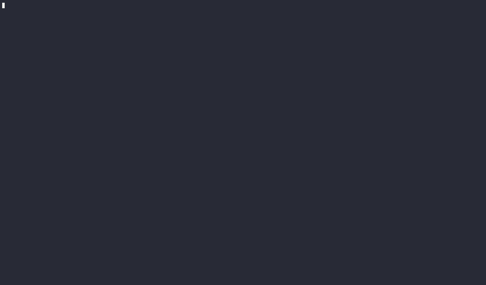

# DODO

DODA Offers Dev Assistance.

It is a full featured LLM chat interface that runs natively within a developers terminal to help with system administration, scripting, and any other CLI oriented task.



## Setup

```bash
cd doda_core
python -m venv .venv
source .venv/bin/activate
pip install -r requirements.txt
cp .env.example .env # add openAI ... other values optional
```

### Optional .env files

By default, all functions require confirmation before the LLM calls them.
To disable this, set `FUNCTION_CONFIRMATION_REQUIRED=false` in the `.env` file.

In order to create gitlab snippets, you will need to generate a private token and set `GITLAB_PRIVATE_TOKEN`. See https://docs.gitlab.com/ee/user/profile/personal_access_tokens.html

## Development

```bash
./.venv/bin/textual run --dev main.py
```

To view a debug console in another tab, run:
`textual console`
